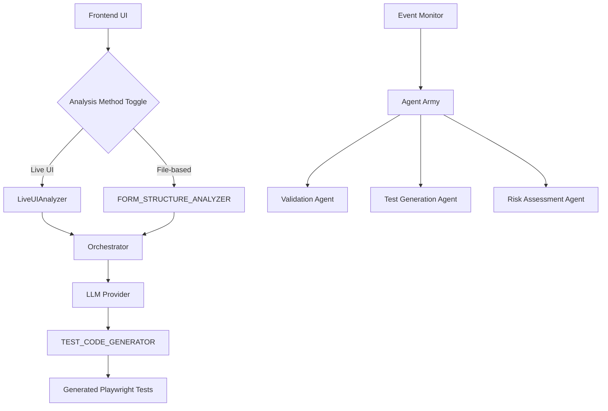

# Architecture Guide - Agentic Testing

Technical reference for developers who want to understand internal architecture, extend functionality, or contribute to the project.

## 🏗️ **System Architecture**

### **High-Level Overview**



### **Core Components**

#### **1. Frontend Layer**

- **UI Components**: Analysis method toggle, form inputs, progress indicators
- **Event Handling**: User interactions, real-time updates
- **State Management**: Analysis method selection, form data
- **File**: `index.html`, `main.js`, `style.css`

#### **2. Backend API Layer**

- **Express Server**: RESTful API endpoints
- **Request Handling**: Analysis requests, file uploads
- **Response Management**: Progress updates, results delivery
- **File**: `server/index.js`

#### **3. Analysis Layer**

- **LiveUIAnalyzer**: Puppeteer-based live DOM analysis
- **FormStructureAnalyzer**: LLM-based HTML content analysis
- **Advanced UI Analyzer**: Complex scenario analysis (ready for integration)
- **Files**: `server/liveUIAnalyzer.js`, `server/advanced-ui-analyzer-concept.js`

#### **4. Orchestration Layer**

- **Orchestrator**: Main coordination logic
- **Method Selection**: Live vs File-based analysis routing
- **Pipeline Management**: Multi-step analysis and generation
- **File**: `server/orchestrator.js`

#### **5. AI/LLM Layer**

- **Provider Abstraction**: Ollama, Bedrock, OpenAI support
- **Prompt Engineering**: Optimized prompts for different scenarios
- **Response Processing**: Structured output parsing
- **Files**: `server/prompts.js`, `server/utils.js`

## 🔧 **Technical Implementation**

### **Analysis Methods Deep Dive**

#### **Live UI Analysis**

```javascript
// server/liveUIAnalyzer.js
class LiveUIAnalyzer {
  async analyzeForm(url) {
    const browser = await puppeteer.launch({
      headless: true,
      args: ["--no-sandbox", "--disable-setuid-sandbox"],
    });

    const page = await browser.newPage();
    await page.goto(url);

    // Extract form structure
    const formData = await page.evaluate(() => {
      const forms = Array.from(document.querySelectorAll("form"));
      return forms.map((form) => ({
        action: form.action,
        method: form.method,
        fields: Array.from(form.elements).map((field) => ({
          name: field.name,
          type: field.type,
          required: field.required,
          validation: this.extractValidation(field),
        })),
      }));
    });

    await browser.close();
    return this.formatFormContext(formData);
  }
}
```

**Key Features:**

- Direct DOM manipulation
- Real-time state capture
- No LLM dependency for basic analysis
- JavaScript execution context
- Dynamic behavior detection

#### **File-based Analysis**

```javascript
// server/orchestrator.js (file-based path)
async analyzeFileContent(htmlContent) {
  const prompt = FORM_STRUCTURE_ANALYZER.buildPrompt(
    htmlContent,
    this.description,
    this.acceptanceCriteria
  );

  const response = await this.llmProvider.generate(prompt);
  return JSON.parse(response);
}
```

**Key Features:**

- LLM-powered analysis
- Static HTML parsing
- Inference-based validation rules
- Fast offline analysis
- No browser dependencies

### **Advanced UI Analyzer (Ready for Integration)**

```javascript
// server/advanced-ui-analyzer-concept.js
const ADVANCED_UI_ANALYZER = {
  buildPrompt: (domSnapshot, userActions, description, acceptanceCriteria) => {
    return `Analyze this live UI behavior:
    
    DOM Snapshot: ${JSON.stringify(domSnapshot, null, 2)}
    User Actions: ${JSON.stringify(userActions, null, 2)}
    
    Identify:
    1. Dynamic validation rules not visible in static DOM
    2. Conditional field dependencies
    3. Multi-step form logic
    4. Error handling patterns
    5. Business rule enforcement
    
    Return enhanced form context with dynamic behaviors...`;
  },
};
```

**Capabilities:**

- Multi-step form workflow analysis
- Conditional field dependency detection
- Dynamic validation rule capture
- Business logic enforcement identification
- Complex interaction pattern recognition

### **Event-Driven Agent Architecture**

```javascript
// server/liveEventMonitor.js (Proof of Concept)
class LiveEventMonitor extends EventEmitter {
  async startMonitoring(page) {
    // Listen for form interactions
    await page.evaluate(() => {
      document.addEventListener("submit", (e) => {
        window.agenticTestingEvents.emit("formSubmit", {
          form: e.target,
          data: new FormData(e.target),
        });
      });
    });
  }
}

// Usage
monitor.on("formSubmit", async (data) => {
  await agents.validation.analyze(data);
  await agents.testGeneration.generate(data);
  await agents.riskAssessment.evaluate(data);
});
```

## 🎨 **Code Architecture Patterns**

### **1. Strategy Pattern - Analysis Methods**

```javascript
class AnalysisStrategy {
  async analyze(input) {
    throw new Error("Must implement analyze method");
  }
}

class LiveUIStrategy extends AnalysisStrategy {
  async analyze(url) {
    return await this.liveUIAnalyzer.analyzeForm(url);
  }
}

class FileBasedStrategy extends AnalysisStrategy {
  async analyze(htmlContent) {
    return await this.llmProvider.analyzeHTML(htmlContent);
  }
}
```

### **2. Factory Pattern - LLM Providers**

```javascript
class LLMProviderFactory {
  static create(provider) {
    switch (provider) {
      case "ollama":
        return new OllamaProvider();
      case "bedrock":
        return new BedrockProvider();
      case "openai":
        return new OpenAIProvider();
      default:
        throw new Error(`Unknown provider: ${provider}`);
    }
  }
}
```

### **3. Observer Pattern - Event System**

```javascript
class AgentOrchestrator extends EventEmitter {
  constructor() {
    super();
    this.agents = new Map();
  }

  registerAgent(name, agent) {
    this.agents.set(name, agent);
    agent.on("result", (data) => {
      this.emit("agentResult", { agent: name, data });
    });
  }
}
```

## 🔮 **Advanced Features**

### **1. Multi-Step Form Analysis**

```javascript
class MultiStepAnalyzer {
  async analyzeWorkflow(startUrl) {
    const steps = [];
    let currentUrl = startUrl;

    while (currentUrl) {
      const stepAnalysis = await this.analyzeStep(currentUrl);
      steps.push(stepAnalysis);
      currentUrl = stepAnalysis.nextStep;
    }

    return {
      workflow: steps,
      totalSteps: steps.length,
      criticalPaths: this.identifyCriticalPaths(steps),
    };
  }
}
```

### **2. Dynamic Validation Detection**

```javascript
class ValidationRuleDetector {
  async detectDynamicRules(page) {
    // Inject validation detection script
    await page.addScriptTag({
      content: `
        window.validationRules = [];
        const originalSetCustomValidity = HTMLElement.prototype.setCustomValidity;
        HTMLElement.prototype.setCustomValidity = function(message) {
          window.validationRules.push({
            element: this.name || this.id,
            message: message,
            timestamp: Date.now()
          });
          return originalSetCustomValidity.call(this, message);
        };
      `,
    });

    // Trigger various inputs to capture validation
    await this.simulateUserInteractions(page);

    // Extract captured validation rules
    const rules = await page.evaluate(() => window.validationRules);
    return this.processValidationRules(rules);
  }
}
```

### **3. Business Logic Inference**

```javascript
class BusinessLogicAnalyzer {
  analyzeBusinessRules(formContext, userInteractions) {
    const rules = [];

    // Age-based restrictions
    if (this.hasAgeField(formContext)) {
      rules.push({
        type: "age_restriction",
        condition: "age >= 18",
        message: "Must be 18 or older",
      });
    }

    // Conditional field requirements
    const conditionalFields = this.detectConditionalFields(formContext);
    rules.push(...conditionalFields);

    return rules;
  }
}
```

## 🧪 **Test Generation Engine**

### **Modern Playwright Patterns**

```javascript
// server/prompts.js - TEST_CODE_GENERATOR
const TEST_CODE_GENERATOR = {
  buildPrompt: (formContext, description, acceptanceCriteria) => {
    return `Generate modern Playwright test code using these patterns:

    REQUIRED PATTERNS:
    1. Use page.locator() instead of page.$() or page.$$()
    2. Use .fill('') instead of .type() for inputs
    3. Use expect(locator).toBeVisible() for assertions
    4. Use proper async/await patterns
    5. Include proper error handling

    FORM CONTEXT:
    ${JSON.stringify(formContext, null, 2)}

    Generate comprehensive test scenarios:
    - Valid input testing
    - Required field validation
    - Business rule enforcement
    - Error message verification
    - Edge case handling`;
  },
};
```

### **Generated Code Quality**

```javascript
// Example of generated modern Playwright code
const { test, expect } = require("@playwright/test");

test("Policy form validation", async ({ page }) => {
  await page.goto("http://localhost:3000/policy-form.html");

  // Test age validation (modern patterns)
  const dobInput = page.locator("#dob");
  await dobInput.fill("2010-01-01"); // Too young

  const submitButton = page.locator("#submit");
  await submitButton.click();

  // Modern assertion pattern
  const errorMessage = page.locator(".error-message");
  await expect(errorMessage).toBeVisible();
  await expect(errorMessage).toHaveText("You must be at least 18 years old");
});
```

## 📊 **Performance Considerations**

### **1. Analysis Performance**

- **Live UI**: ~2-5 seconds per form
- **File-based**: ~1-3 seconds per form
- **Memory usage**: ~50-100MB per analysis
- **Concurrent analysis**: Limited by LLM provider rate limits

### **2. Optimization Strategies**

```javascript
// Caching analysis results
class AnalysisCache {
  constructor() {
    this.cache = new Map();
  }

  getCacheKey(input) {
    return crypto.createHash("md5").update(JSON.stringify(input)).digest("hex");
  }

  async getOrAnalyze(input, analyzer) {
    const key = this.getCacheKey(input);
    if (this.cache.has(key)) {
      return this.cache.get(key);
    }

    const result = await analyzer.analyze(input);
    this.cache.set(key, result);
    return result;
  }
}
```

### **3. Scaling Considerations**

- **Horizontal scaling**: Multiple server instances
- **Load balancing**: Distribute analysis requests
- **Queue management**: Handle high-volume requests
- **Resource monitoring**: Track memory and CPU usage

## 🔧 **Extension Points**

### **1. Adding New Analysis Methods**

```javascript
// Implement new analysis strategy
class CustomAnalysisStrategy extends AnalysisStrategy {
  async analyze(input) {
    // Your custom analysis logic
    return {
      forms: [],
      fields: [],
      validationRules: [],
    };
  }
}

// Register in orchestrator
orchestrator.registerAnalysisMethod("custom", new CustomAnalysisStrategy());
```

### **2. Adding New LLM Providers**

```javascript
class CustomLLMProvider extends LLMProvider {
  async generate(prompt, options = {}) {
    // Your LLM integration
    const response = await this.customLLMAPI.generate(prompt);
    return response.text;
  }
}

// Register provider
LLMProviderFactory.register("custom", CustomLLMProvider);
```

### **3. Adding New Test Frameworks**

```javascript
class CypressTestGenerator extends TestGenerator {
  generateTest(formContext, scenarios) {
    return `
      describe('Form Tests', () => {
        it('validates required fields', () => {
          cy.visit('${formContext.url}');
          cy.get('#${formContext.fields[0].id}').type('invalid');
          cy.get('#submit').click();
          cy.get('.error').should('be.visible');
        });
      });
    `;
  }
}
```

## 🏷️ **Data Structures**

### **FormContext Structure**

```typescript
interface FormContext {
  url?: string;
  htmlContent?: string;
  forms: Form[];
  analysisMethod: "live-ui" | "file-based";
  timestamp: number;
}

interface Form {
  id: string;
  action: string;
  method: string;
  fields: Field[];
  validationRules: ValidationRule[];
}

interface Field {
  id: string;
  name: string;
  type: string;
  required: boolean;
  validation: ValidationRule[];
  dependencies: FieldDependency[];
}

interface ValidationRule {
  type: "required" | "minLength" | "maxLength" | "pattern" | "custom";
  value: any;
  message: string;
}
```

### **Analysis Result Structure**

```typescript
interface AnalysisResult {
  formContext: FormContext;
  testScenarios: TestScenario[];
  recommendations: TestRecommendation[];
  riskAssessment: RiskAssessment;
  coverage: CoverageReport;
}

interface TestScenario {
  name: string;
  type: "positive" | "negative" | "edge_case";
  steps: TestStep[];
  assertions: Assertion[];
}
```

## 🎯 **Best Practices for Developers**

### **1. Code Organization**

- Keep analysis logic separate from UI logic
- Use dependency injection for better testability
- Implement proper error handling and logging
- Follow single responsibility principle

### **2. Testing Strategy**

- Unit tests for individual components
- Integration tests for analysis workflows
- E2E tests for complete user scenarios
- Performance tests for analysis speed

### **3. Error Handling**

```javascript
class RobustAnalyzer {
  async analyze(input) {
    try {
      const result = await this.performAnalysis(input);
      return this.validateResult(result);
    } catch (error) {
      this.logger.error("Analysis failed", { error, input });
      throw new AnalysisError("Failed to analyze input", error);
    }
  }
}
```

### **4. Logging and Monitoring**

```javascript
const logger = {
  info: (message, data) => console.log(`[INFO] ${message}`, data),
  error: (message, data) => console.error(`[ERROR] ${message}`, data),
  debug: (message, data) => console.debug(`[DEBUG] ${message}`, data),
};

// Usage
logger.info("Starting analysis", { method: "live-ui", url });
```

## 🔄 **Future Roadmap**

### **Phase 1: Core Enhancements**

- [ ] Advanced UI Analyzer full integration
- [ ] Multi-framework support (Cypress, Selenium)
- [ ] Enhanced error handling and recovery
- [ ] Performance optimizations

### **Phase 2: Advanced Features**

- [ ] Visual regression testing
- [ ] API testing integration
- [ ] Multi-language support
- [ ] Cloud deployment options

### **Phase 3: Enterprise Features**

- [ ] User management and authentication
- [ ] Team collaboration features
- [ ] Advanced reporting and analytics
- [ ] Integration with popular CI/CD platforms

## 🛠️ **Development Setup**

### **Local Development**

```bash
# Clone and setup
git clone <repository>
cd agentic-testing
cd server && npm install

# Start development server
npm run dev

# Run tests
npm test

# Run specific test suite
npm run test:unit
npm run test:integration
```

### **Contributing Guidelines**

1. Fork the repository
2. Create feature branch: `git checkout -b feature/amazing-feature`
3. Follow coding standards and add tests
4. Commit changes: `git commit -m 'Add amazing feature'`
5. Push to branch: `git push origin feature/amazing-feature`
6. Create pull request

---

**This architecture is designed to be extensible, maintainable, and production-ready. For hands-on development, check the [Dev Tools Guide](../server/dev-tools/HOW_TO.md).**
