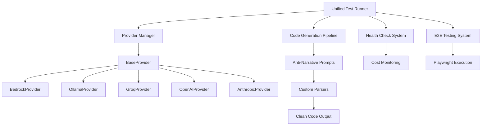

# Architecture Guide - Agentic Testing (Unified Framework)

Complete technical reference for the unified agentic testing framework with modular LLM providers.

## 🏗️ **System Architecture Overview**

The framework has been completely refactored into a **unified, centralized architecture** with the following principles:

- **Single Entry Point**: All testing operations through `unified-test-runner.js`
- **Modular Providers**: Each LLM provider is self-contained with standardized interface
- **Anti-Narrative Prompts**: Direct code output without explanations
- **Health Monitoring**: Built-in availability and cost tracking
- **Production Ready**: Clean error handling and standardized outputs

### **High-Level Architecture**



## 🎯 **Core Components**

### **1. Unified Test Runner** (`dev-tools/unified-test-runner.js`)

The central orchestrator that handles all testing operations:

```javascript
// Main entry point for all operations
class UnifiedTestRunner {
  constructor() {
    this.providerManager = new ProviderManager();
    this.testResults = {
      /* ... */
    };
  }

  // Health check all providers
  async healthCheck() {
    /* ... */
  }

  // Run E2E tests
  async runE2ETest(provider, model) {
    /* ... */
  }

  // Clean all test data
  async cleanAll() {
    /* ... */
  }
}
```

**Usage Examples:**

```bash
# Health check all providers
node dev-tools/unified-test-runner.js --health-check --all-providers

# E2E test with specific provider
node dev-tools/unified-test-runner.js --e2e --bedrock-claude4

# Clean all test data
node dev-tools/unified-test-runner.js --clean-all
```

### **2. Provider System** (`providers/`)

Modular LLM provider architecture with standardized interface:

#### **BaseProvider** (`providers/BaseProvider.js`)

Abstract base class defining the interface:

```javascript
class BaseProvider {
  constructor(config) {
    /* ... */
  }

  // Must be implemented by subclasses
  async initialize() {
    /* ... */
  }
  async isAvailable() {
    /* ... */
  }
  async call({ prompt, system, temperature, model }) {
    /* ... */
  }

  // Built-in utilities
  async test() {
    /* Health check */
  }
  _validateParams() {
    /* Parameter validation */
  }
  _parseResponse() {
    /* Response parsing */
  }
  _handleError() {
    /* Error handling */
  }
}
```

#### **Provider Implementations**

**BedrockProvider** (`providers/BedrockProvider.js`):

- AWS Bedrock integration with Claude 4 optimization
- Inference profiles for cost optimization
- Anti-narrative system prompts
- Custom parser for clean code extraction

**OllamaProvider** (`providers/OllamaProvider.js`):

- Local Ollama model support (Qwen, Llama, etc.)
- No API key required
- Streaming response support
- Custom timeout handling

**GroqProvider, OpenAIProvider, AnthropicProvider**:

- Cloud API integrations
- Rate limiting and error handling
- Standardized parameter mapping
- Cost tracking and monitoring

#### **ProviderManager** (`providers/index.js`)

Factory and management system:

```javascript
class ProviderManager {
  constructor() {
    this.providers = new Map();
    this.currentProvider = null;
  }

  // Get specific provider
  getProvider(name) {
    /* ... */
  }

  // Get all available providers
  getAvailableProviders() {
    /* ... */
  }

  // Health check all providers
  async healthCheckAll() {
    /* ... */
  }
}
```

### **3. Core Utilities** (`utils.js`)

Unified LLM calling interface:

```javascript
// Main dispatcher function
async function callLLM({ prompt, system, temperature, provider, model }) {
  const providerManager = new ProviderManager();
  const selectedProvider = providerManager.getProvider(provider);
  return await selectedProvider.call({ prompt, system, temperature, model });
}
```

## 🚀 **Key Features**

### **Anti-Narrative Prompt System**

All providers use optimized prompts for direct code output:

```javascript
// Example system prompt (BedrockProvider)
const ANTI_NARRATIVE_SYSTEM = `
You are a code generator. Output ONLY the requested code.
NO explanations, NO comments, NO narrative text.
Just pure, clean, functional code.
`;
```

### **Custom Response Parsers**

Each provider has custom parsers to extract clean code:

````javascript
// Example parser (BedrockProvider)
_parseResponse(response) {
    // Remove common narrative patterns
    let cleaned = response
        .replace(/^Here's.*?:|^This.*?:|^The.*?:/gm, '')
        .replace(/```javascript|```js|```/g, '')
        .replace(/\/\*.*?\*\//gs, '')
        .trim();

    return cleaned;
}
````

### **Health Check System**

Built-in monitoring for all providers:

```javascript
// Health check with cost tracking
const healthResult = await provider.test();
console.log({
  success: healthResult.success,
  provider: healthResult.provider,
  model: healthResult.model,
  cost: healthResult.cost,
  tokens: healthResult.tokens,
});
```

### **Cost and Token Tracking**

Real-time monitoring of LLM usage:

```javascript
// Example cost tracking (BedrockProvider)
const tokensUsed = response.usage.totalTokens;
const estimatedCost = (tokensUsed / 1000) * 0.008; // Example rate
console.log(`Tokens: ${tokensUsed}, Cost: $${estimatedCost}`);
```

## 📁 **File Structure**

```
server/
├── providers/                  # Modular LLM providers
│   ├── BaseProvider.js        # Abstract base class
│   ├── BedrockProvider.js     # AWS Bedrock (Claude 4)
│   ├── OllamaProvider.js      # Local Ollama models
│   ├── GroqProvider.js        # Groq Cloud API
│   ├── OpenAIProvider.js      # OpenAI API
│   ├── AnthropicProvider.js   # Anthropic API
│   └── index.js               # ProviderManager
├── dev-tools/                 # Testing orchestration
│   ├── unified-test-runner.js # Main orchestrator
│   ├── README.js              # Complete documentation
│   ├── unified-architecture-success.js # Summary
│   ├── refactor-summary.js    # Refactor docs
│   └── claude4-optimization-summary.js # Claude 4 docs
├── utils.js                   # Core utilities (callLLM)
├── index.js                   # Server entry point
└── package.json               # Dependencies
```

## 🎯 **Testing Workflow**

1. **Health Check**: Verify provider availability and credentials
2. **Code Generation**: Generate test code using anti-narrative prompts
3. **Parsing**: Extract clean code using custom parsers
4. **Validation**: Syntax check and basic validation
5. **Execution**: Run generated tests with Playwright
6. **Reporting**: Standardized results with cost/token metrics

## 💡 **Best Practices**

### **Adding New Providers**

1. Extend `BaseProvider` class
2. Implement required methods (`initialize`, `isAvailable`, `call`)
3. Add anti-narrative system prompts
4. Create custom response parser
5. Add to `ProviderManager`
6. Test with `unified-test-runner.js`

### **Using Anti-Narrative Prompts**

```javascript
// Good: Specific, direct request
const prompt = "Generate Playwright test code for form validation";
const system = "Output only code. No explanations.";

// Bad: Allows narrative response
const prompt = "Can you help me create a test?";
const system = "You are a helpful assistant.";
```

### **Error Handling**

All providers use standardized error handling:

```javascript
try {
  const result = await provider.call({ prompt, system });
  return result;
} catch (error) {
  // Standardized error handling in BaseProvider
  throw new Error(`${provider.name} failed: ${error.message}`);
}
```

## 🔧 **Configuration**

### **Environment Variables**

```bash
# AWS Bedrock
AWS_REGION=ap-southeast-1
AWS_ACCESS_KEY_ID=your_key
AWS_SECRET_ACCESS_KEY=your_secret

# Groq
GROQ_API_KEY=your_key

# OpenAI
OPENAI_API_KEY=your_key

# Anthropic
ANTHROPIC_API_KEY=your_key

# Ollama (local)
OLLAMA_BASE_URL=http://localhost:11434
```

### **Provider Configuration**

```javascript
// Example provider config
const providerConfig = {
  name: "AWS Bedrock",
  defaultModel: "apac.anthropic.claude-sonnet-4-20250514-v1:0",
  timeout: 120000,
  maxTokens: 4000,
  requiresApiKey: true,
};
```

## 📊 **Monitoring and Observability**

### **Health Metrics**

- Provider availability status
- Response time monitoring
- Error rate tracking
- Cost per request

### **Usage Metrics**

- Token consumption
- Request volume
- Success/failure rates
- Cost analysis

## 🚀 **Future Enhancements**

1. **Caching Layer**: Cache expensive LLM calls
2. **Load Balancing**: Distribute requests across providers
3. **Circuit Breaker**: Handle provider failures gracefully
4. **Metrics Dashboard**: Real-time monitoring UI
5. **Auto-Scaling**: Dynamic provider selection based on load

## ✅ **Architecture Benefits**

🎯 **Centralized**: Single entry point for all operations  
🔧 **Modular**: Easy to add/remove providers  
🧹 **Clean**: Anti-narrative, direct code output  
📊 **Observable**: Health checks and cost monitoring  
💰 **Cost-Aware**: Token usage and cost tracking  
🔒 **Robust**: Standardized error handling  
🚀 **Scalable**: Production-ready architecture

---

**For complete usage examples and documentation, run:**

```bash
node server/dev-tools/README.js
```
